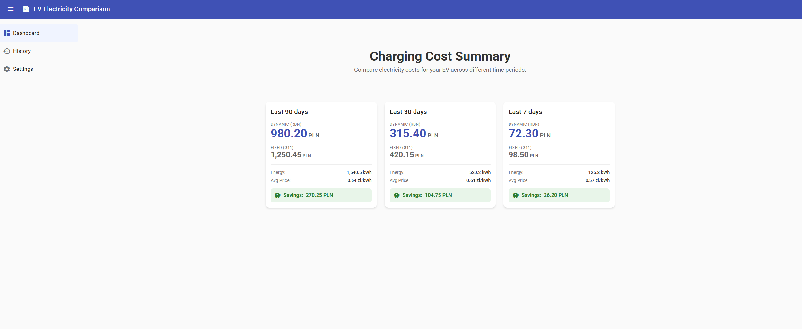

# ⚡ EV Electricity Price Comparison

A comprehensive tool for Electric Vehicle (EV) owners to compare charging costs between fixed-rate (G11) and dynamic-rate (RDN) electricity tariffs in Poland. 

## 🚀 Overview

This application helps users optimize their EV charging strategy by analyzing historical charging data from **TeslaMate** and comparing it against real-time and historical electricity prices from **PSE (Polskie Sieci Elektroenergetyczne)**.

### Key Features
- **Real-time Price Integration**: Automated fetching of hourly electricity prices from the official PSE API.
- **TeslaMate Integration**: Automatic synchronization of charging sessions directly from your TeslaMate database.
- **Cost Analysis**: Granular comparison of costs between standard G11 tariffs and dynamic pricing.
- **Interactive Dashboard**: Visualize energy consumption, average prices, and potential savings over 7, 30, and 90-day periods.
- **Modern UI**: Built with Angular 19+, Material Design, and a responsive collapsible navigation system.

## 🏗️ Tech Stack

### Backend
- **Framework**: [NestJS](https://nestjs.com/) (Node.js)
- **Database**: PostgreSQL with TypeORM
- **Language**: TypeScript
- **Integrations**: PSE API (Electricity prices), TeslaMate (Charging data)

### Frontend
- **Framework**: [Angular 19](https://angular.dev/)
- **UI Library**: Angular Material
- **State Management**: Angular Signals
- **Styling**: Vanilla CSS/SCSS

## 🗺️ Roadmap (Upcoming Tasks)

Based on our [GitHub Project](https://github.com/damianpia/ev-electricity-price-comparison/projects/1):

### 🛠️ In Progress / Planned
- [ ] **EV-18/14**: Full Authentication flow (OAuth2/OIDC/JWT) and user settings.
- [ ] **EV-19/20**: Detailed charging history browser and daily breakdown.
- [ ] **EV-12**: Advanced cost calculation engine including transmission fees.
- [ ] **EV-21**: **Research & Simulation**: Optimized charging strategy (Cheapest hour simulation).
- [ ] **EV-17**: OpenAPI (Swagger) documentation for the backend API.
- [ ] **EV-3**: Automated CI/CD pipelines and deployment on local **k3s** (miniPC homelab).

## 🛠️ Development

### Prerequisites
- Node.js (v20+)
- PostgreSQL
- Docker & Docker Compose (optional for local DB)

### Setup
1. Clone the repository.
2. Install dependencies: `npm install`.
3. Configure environment variables in `.env` (see `.env.example`).
4. Start the development environment: `npm run dev`.

## 📜 License
This project is for personal use in a homelab environment.

---
*Developed for a miniPC homelab setup.*
